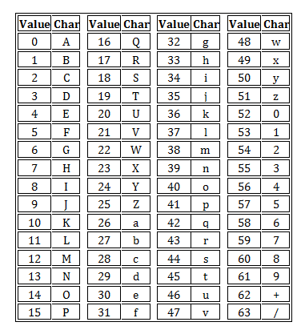

## 什么是source map
通俗的来说， Source Map 就是一个信息文件，里面存储了代码打包转换后的位置信息，实质是一个 json 描述文件，维护了打包前后的代码映射关系。

### 结构
```json
{
  "version": 3,
  "file": "",
  "mappings": "",
  "sources": [],
  "sourcesContent": [],
  "names": [],
  "sourceRoot": ""
}
```

#### version
Source map的版本，目前为3。
#### file
转换后的文件名。
#### mappings
记录位置信息的字符串。
#### sources
转换前的文件列表。该项是一个数组，表示可能存在多个文件合并。
#### sourcesContent
字符串数组，原始代码的内容
#### names
转换前的所有变量名和属性名。
#### sourceRoot
转换前的文件所在的目录。如果与转换前的文件在同一目录，该项为空。

#### mappings 属性详解
mappings 属性是将源码和丑化后的代码一一对应的主要功臣，那么它们是如何对应起来的呢？
这是一个很长的字符串，它分成三层。
> 第一层是行对应，以分号（;）表示，每个分号对应转换后源码的一行。所以，第一个分号前的内容，就对应源码的第一行，以此类推。

举例来说，假定mappings属性的内容如下：
> mappings:"AAAAA,BBBBB;CCCCC"

表示，转换后的源码分成两行，如下。
```json
[
  // 产物第一行映射信息
  'AAAAA,BBBBB',
  // 产物第二行映射信息
  'CCCCC'
]
```

> 第二层是位置对应，以逗号（,）表示，每个逗号对应转换后源码的一个位置。所以，第一个逗号前的内容，就对应该行源码的第一个位置，以此类推。

表示，转换后的源码分成两行，第一行有2个位置映射，第二行有1个位置映射，如下。
```json
[
  // 产物第一行映射信息
  [
    // 第一行的第一个映射位置
    'AAAAA',
    // 第一行的第二个映射位置
    'BBBBB'
  ]
  // 产物第二行映射信息
  [
    // 第二行的第一个映射位置
    'CCCCC'
  ]
]
```

> 第三层是位置转换，以VLQ编码表示，代表该位置对应的转换前的源码位置。

VLQ 本质上是一种将整数数值转换为 Base64 的编码算法，它先将任意大的整数转换为一系列六位字节码，再按 Base64 规则转换为一串可见字符。VLQ 使用六位比特存储一个编码分组，例如：


数字 7 经过 VLQ 编码后，结果为 001110即字母O，其中：
+ 第一位为连续标志位，标识后续分组是否为同一数字；
+ 第六位表示该数字的正负符号，0为正整数，1为负整数；
+ 中间第 2-5 为实际数值。

但是，分组中只有中间的 4 个字节用于表示数值，因此单个分组只能表达 「-15 ~ 15」 之间的数值范围，对于超过这个范围的整数需要组合多个分组共同表达同一数字， VLQ编码步骤：
+ 对十进制数字进行二进制化
+ 在二进制结果后补“符号位”，若为正数则补 0，若为负数则补 1
+ 将二进制每隔5位进行分段，如果最高位所在的段不足5位，则前面补0。
+ 将分段后的组进行反转操作。
+ 在每一组的最前面添加一个"连续位"，除了最后一组为0，其他都为1。
+ 将每一组转成Base 64编码并拼接。



以 7 为例:
```text
// 十进制转二进制
7 => 111(符号位为 0)

// 补“符号位”
111 => 1110

// 每隔5位进行分段, 如果最高位所在的段不足5位，则前面补0
1110 => 01110

// 反转操作 (该案例仅1组, 不需要进行反转)
01110 => 01110

// 添加"连续位"(该案例仅1组, 即为最后一组, 补0)
01110 => 001110

// 转Base 64编码 (二进制转十进制，然后查表)
001110 => 14 => O
```

以 17 为例:
```text
// 十进制转二进制
17 => 10001(符号位为 0)

// 补“符号位”
10001 => 100010

// 每隔5位进行分段, 如果最高位所在的段不足5位，则前面补0
100010 => [00001, 00010]

// 反转操作 
[00001, 00010] => [00010, 00001]

// 添加"连续位"
[00010, 00001] => [100010, 000001]

// 转Base 64编码 (二进制转十进制，然后查表)
[100010, 000001] => [34, 1] => [i, B] => iB
```

